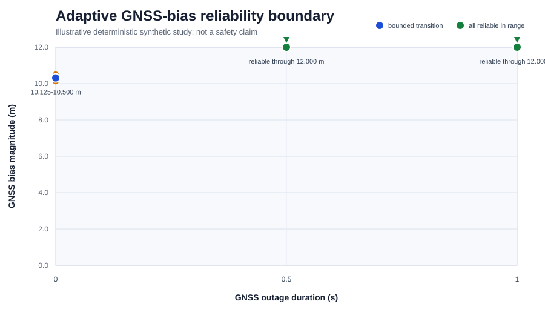
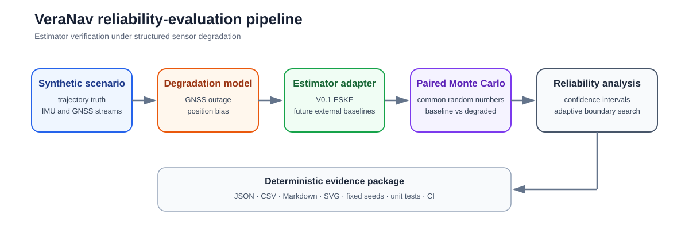
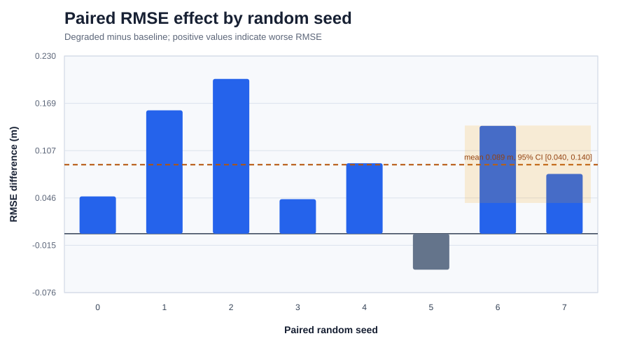

# VeraNav

**Verification and Reliability Assessment for Navigation Estimators**

[](https://github.com/itollbeep/VeraNav/actions/workflows/tests.yml)
[](LICENSE)
[](pyproject.toml)

VeraNav is a reproducible framework for evaluating when a navigation estimator remains reliable under structured sensor degradation. It combines a compact error-state Kalman filter, deterministic synthetic IMU/GNSS experiments, paired Monte Carlo comparisons, consistency metrics, confidence intervals, and adaptive reliability-boundary search.

The central question is not only **how accurate is the estimator under nominal conditions?** It is also:

> **At what degradation level does the estimator cross from reliable operation into failure?**



The figure above is generated from the committed synthetic quick study. It demonstrates the reporting pipeline; it is not a real-world performance claim or a safety-certification result.

## Why VeraNav

A conventional navigation demo usually reports one trajectory and one RMSE value. VeraNav adds a reliability-analysis layer:

- structured GNSS outage and position-bias injection
- identical random seeds for baseline and degraded runs
- paired RMSE and maximum-error differences
- percentile bootstrap confidence intervals
- NIS and NEES consistency statistics
- Wilson intervals for Monte Carlo failure rates
- deterministic adaptive search for the reliable-to-unreliable boundary
- JSON, CSV, Markdown, and SVG evidence generated from one study
- fixed-seed tests and continuous integration

The V0.1 estimator is an ESKF implemented inside this repository. The evaluation protocol is designed so that future external estimator adapters can be compared under the same seeds, degradation coordinates, failure criteria, and reporting rules.

## Architecture



The current implementation separates six concerns:

1. **Scenario generation**: analytic circular truth with deterministic IMU and GNSS simulation.
2. **Degradation injection**: half-open outage and bias windows with explicit precedence.
3. **State estimation**: nominal IMU propagation, 15-state covariance propagation, and GNSS position updates.
4. **Consistency evaluation**: NIS, NEES, RMSE, maximum error, and failure classification.
5. **Paired reliability studies**: common-random-number comparisons and adaptive boundary search.
6. **Evidence export**: stable JSON, CSV, Markdown, and SVG artifacts.

See [docs/architecture.md](docs/architecture.md) and [docs/reliability_protocol.md](docs/reliability_protocol.md) for the scientific and software boundaries.

## V0.1 scope

Implemented:

- NED navigation frame and FRD body frame
- Hamilton scalar-first quaternion convention
- right local attitude perturbation
- 16-parameter nominal state and 15-dimensional error state
- midpoint IMU nominal propagation
- continuous-time error dynamics
- Van Loan covariance discretization
- GNSS position measurement update
- Joseph covariance form
- error injection and attitude-reset covariance
- NIS and NEES
- deterministic circular trajectory, IMU, and GNSS simulation
- GNSS outage and position-bias degradation
- Monte Carlo failure analysis
- paired bootstrap confidence intervals
- Wilson failure-rate intervals
- adaptive GNSS-bias boundary search
- deterministic reports and figures

Not claimed in V0.1:

- real-world navigation performance
- aviation, automotive, or robotic safety certification
- protection-level or integrity-risk guarantees
- production-time synchronization or calibration
- completed OpenVINS, KF-GINS, or other external estimator reproduction
- visual, LiDAR, radar, or wheel-odometry measurement models

## Quick start

VeraNav is developed with Python 3.10.

```bash
python3 -m venv .venv
.venv/bin/python -m pip install --upgrade pip
.venv/bin/python -m pip install -e .
```

Run the complete test suite:

```bash
PYTHONPATH=src .venv/bin/python -m unittest discover -s tests -v
```

Generate a deterministic quick study:

```bash
PYTHONPATH=src .venv/bin/python scripts/run_reliability_study.py \
  --quick \
  --seeds 8 \
  --output-dir outputs/quick_study
```

Render its figures without adding another plotting dependency:

```bash
PYTHONPATH=src .venv/bin/python scripts/render_study_svg.py \
  outputs/quick_study/study.json \
  outputs/quick_study
```

The study writes:

```text
outputs/quick_study/
├── adaptive_boundary.csv
├── paired_comparison.csv
├── paired_rmse_differences.svg
├── reliability_boundary.svg
├── report.md
└── study.json
```

A byte-deterministic example is committed in [examples/quick_study](examples/quick_study).

## Example paired result



For the committed quick study, the degraded-minus-baseline mean position-RMSE difference is reported together with a paired bootstrap interval. Seed-wise bars preserve the pairing and expose variability that a single aggregate RMSE would hide.

The example uses a short synthetic trajectory and eight seeds to keep repository verification fast. It should be interpreted as an executable method demonstration, not a statistically mature benchmark.


## Estimator adapter boundary

VeraNav now defines a versioned position-trajectory boundary for estimator adapters:

```text
timestamp_s,north_m,east_m,down_m
```

The internal ESKF is exposed through this boundary, and a shell-free command runner validates external CSV output before evaluation. Run the adapter smoke test with:

```bash
PYTHONPATH=src .venv/bin/python scripts/run_adapter_smoke.py \
  --output-dir outputs/adapter_smoke \
  --seed 0
```

The planned KF-GINS and OpenVINS baselines are described in `configs/baselines/`. Their status remains `planned`: the repository contains the interface, validation, and licensing boundary, but does not yet claim a successful external build or dataset reproduction. See [docs/adapter_protocol.md](docs/adapter_protocol.md).

## Scientific conventions

The core convention set is frozen in [docs/scientific_conventions.md](docs/scientific_conventions.md):

- `R_nb` maps body-frame coordinates into the navigation frame
- `q_nb` represents the same rotation
- quaternions use Hamilton multiplication and `[w, x, y, z]` storage
- attitude error is a right local perturbation
- gravity is positive down in NED
- the error-state order is position, velocity, attitude, accelerometer bias, gyroscope bias

The detailed ESKF equations are documented in [docs/eskf_model.md](docs/eskf_model.md).

## Reliability protocol

The default paired experiment uses the same seed for the baseline and degraded runs. This holds the simulated noise and initial perturbation common across conditions and makes run-level differences interpretable as degradation effects.

The adaptive search evaluates the endpoints of a configured GNSS-bias range and bisects a reliable-to-unreliable transition until the requested bracket tolerance is reached. Every evaluated coordinate and its failure-rate interval is retained in `study.json`.

The default V0.1 demonstration classifies a coordinate from observed failures. Stronger claims require larger Monte Carlo samples, a confidence-bound decision rule, realistic sensor models, and external validation.

## Repository layout

```text
VeraNav/
├── configs/                 configuration conventions
├── data/                    local data boundary; generated data are ignored
├── docs/                    scientific conventions, models, and protocol
├── examples/quick_study/    committed deterministic evidence example
├── experiments/             experiment organization conventions
├── scripts/                 executable study and rendering entry points
├── src/veranav/             estimator, simulation, statistics, and reporting code
└── tests/                   deterministic unit and numerical tests
```

## Research positioning

The standard components in VeraNav—ESKF propagation, GNSS updates, NIS, and NEES—are intentionally explicit and heavily tested. The differentiating contribution is the evaluation protocol built around them:

- estimator-independent degradation coordinates
- paired common-random-number experiments
- uncertainty-aware failure-rate reporting
- adaptive reliability-boundary estimation
- deterministic evidence export

A more detailed statement of contribution, limitations, and extension targets is provided in [docs/project_overview.md](docs/project_overview.md).

## Roadmap

Near-term work:

- complete clean builds and dataset reproductions for KF-GINS and OpenVINS
- additional GNSS faults, IMU bias drift, scale-factor errors, and timing offsets
- multidimensional reliability surfaces
- real-dataset replay and simulator-to-real comparison
- recovery time, first-failure time, and calibration diagnostics
- stronger confidence-bound reliability requirements

The repository will keep external projects separate and will not copy license-incompatible source code into the Apache-2.0 codebase.

## Reproducibility

All repository examples use explicit random seeds. Tests cover formula identities, finite-difference Jacobians, covariance properties, input immutability, paired statistics, boundary caching, stable serialization, and deterministic figure generation.

Continuous integration runs the unit suite, compilation checks, a quick reliability study, and SVG rendering.

## Citation

Citation metadata are provided in [CITATION.cff](CITATION.cff). Project changes are recorded in [CHANGELOG.md](CHANGELOG.md).

## License

VeraNav is licensed under the Apache License 2.0. See [LICENSE](LICENSE).

## External estimator reproduction

VeraNav includes a deterministic importer and compact evidence for the official KF-GINS demonstration. The integration records the pinned upstream revision, source and data hashes, GPS-week normalization, duplicate truth timestamp handling, local NED conversion and aligned 3D position metrics. See [`docs/kf_gins_reproduction.md`](docs/kf_gins_reproduction.md) and [`examples/kf_gins_official`](examples/kf_gins_official).

## OpenVINS v2.7 external baseline

The official OpenVINS v2.7 ROS-free simulator is pinned, built and
executed through its upstream repeatability and simulation entry
points. Compact provenance and execution evidence is stored in
`examples/openvins_official/`; scope and compatibility details are in
`docs/openvins_reproduction.md`.
