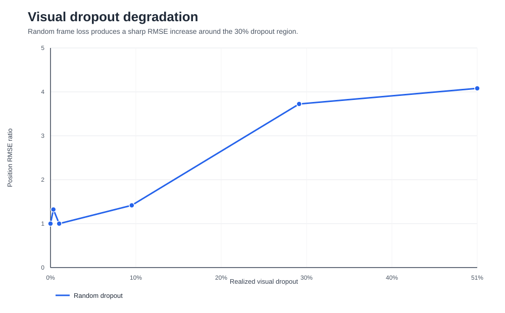
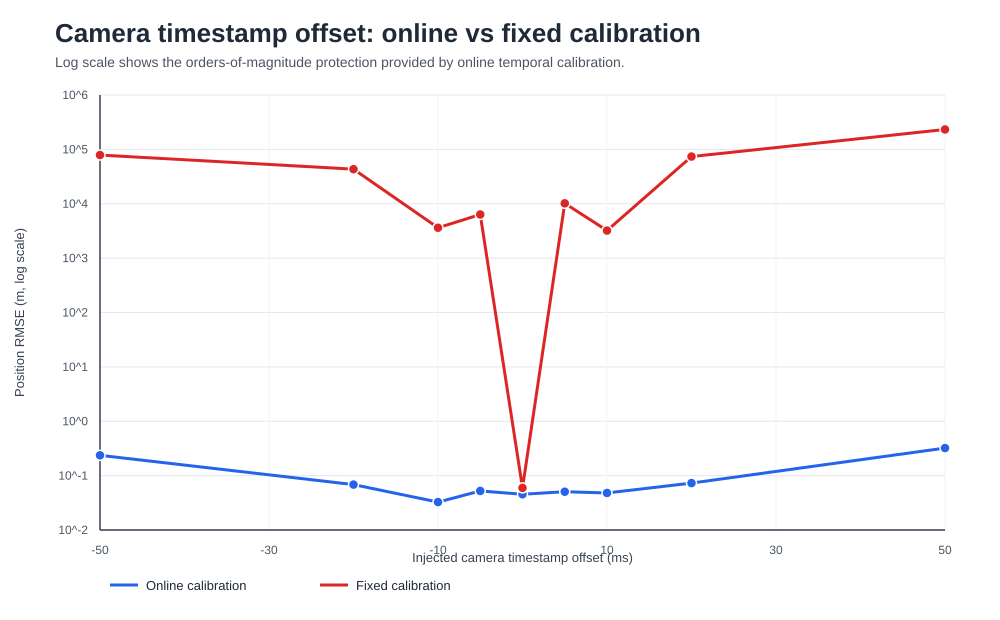
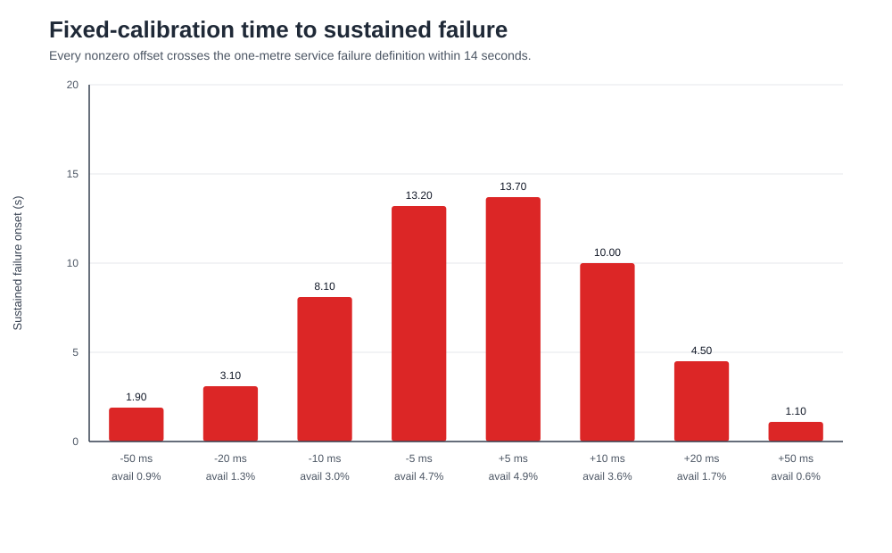
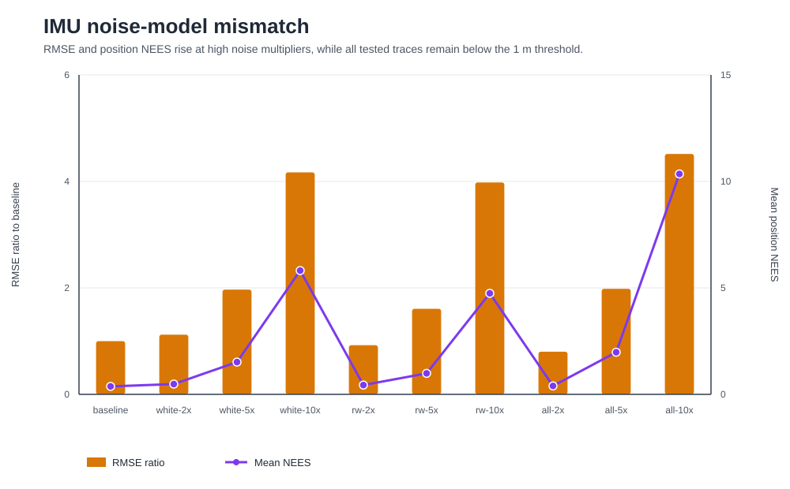

# OpenVINS reliability synthesis

## Scope

This document consolidates six committed OpenVINS experiment families:

- random visual dropout
- timed visual burst outages
- camera timestamp offsets with online calibration
- camera timestamp offsets with fixed calibration
- fixed-offset trace-level divergence diagnostics
- IMU white-noise and bias-random-walk degradation

No estimator is rerun. Every input manifest and result file is hashed,
and all generated tables and figures are produced twice and compared
byte for byte.

## Cross-experiment summary

| Family | Scenarios | Headline metric | Value | Conclusion |
|---|---:|---|---:|---|
| visual_dropout | 6 | worst_rmse_ratio | 4.08073 | Random visual dropout becomes strongly harmful near 30 percent and above on the tested trajectory. |
| visual_burst | 9 | worst_local_rmse_ratio | 3.06584 | Short visual outages are strongly timing-dependent; local metrics expose failures hidden by global RMSE. |
| camera_time_offset_online | 9 | worst_online_rmse_m | 0.3215 | Online temporal calibration keeps every tested signed offset below one metre RMSE. |
| camera_time_offset_fixed | 9 | catastrophic_scenario_count | 8 | Disabling temporal calibration causes catastrophic divergence for every nonzero tested offset. |
| time_divergence | 9 | worst_fixed_max_error_m | 506182 | Trace diagnostics confirm broad persistent failure, not isolated outliers, in all fixed-offset cases. |
| imu_noise | 10 | worst_rmse_ratio | 4.51583 | Ten-times IMU degradation raises RMSE and NEES but does not cross the one-metre service threshold. |

## Main findings

1. Random visual dropout shows a practical degradation breakpoint near
   30% on the tested trajectory. The nearest tested scenario reaches an
   RMSE ratio of `3.725`.

2. Timed visual outages cannot be judged by full-run RMSE alone. The
   worst local RMSE ratio is
   `3.066`, and
   `2` nonbaseline burst scenarios do not satisfy
   the strict recovery definition within the observation horizon.

3. Online camera-to-IMU temporal calibration prevents catastrophic
   failure across all tested ±5 ms to ±50 ms offsets. The worst online
   calibration-aware RMSE is
   `0.321500 m`.

4. With temporal calibration disabled, all
   `8` nonzero offset scenarios are classified as
   catastrophic divergence. The worst maximum error is
   `506181.949 m`.

5. IMU degradation is materially less destructive than fixed temporal
   mismatch in the tested range. The worst IMU RMSE ratio is
   `4.516`, all
   ten traces retain 1 m service availability, and no sustained 1 m
   failure occurs.

6. The combined 10× IMU scenario reaches a maximum mean position NEES
   of `10.351`, indicating a strong consistency warning under
   severe unmodelled noise. This remains a deterministic diagnostic,
   not an ensemble consistency claim.

## Reliability ordering for the tested configuration

From highest observed risk to lowest:

1. fixed camera-to-IMU timestamp mismatch
2. high random visual dropout
3. trajectory-timed visual burst outage
4. severe unmodelled IMU noise

This ordering is specific to the official deterministic simulation
trajectory, OpenVINS v2.7 configuration and tested degradation ranges.

## Figures

### Visual dropout

### Online versus fixed temporal calibration

### Fixed temporal-calibration failure onset

### IMU noise degradation

## Project completion

The fixed six-stage VeraNav v1 research plan is complete:

| Stage | Completion |
|---|---:|
| Stage 1 | 100% |
| Stage 2 | 100% |
| Stage 3 | 100% |
| Stage 4 | 100% |
| Stage 5 | 100% |
| Stage 6 | 100% |
| Weighted overall | 100.0% |

Completion means the current v1 baseline, degradation experiments,
validation layer, evidence records and synthesis are finished. It does
not imply that OpenVINS reliability has been characterized across all
datasets, trajectories, sensors or operating conditions.
