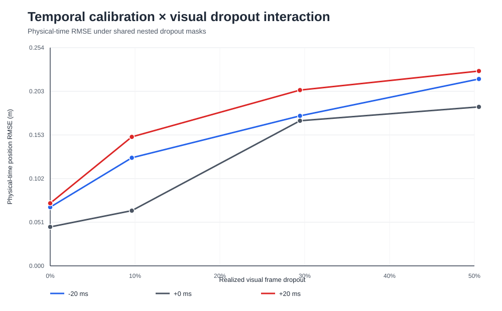

# OpenVINS temporal-calibration × visual-dropout interaction

## Design

This preregistered 3 × 4 factorial pilot combines camera timestamp
offsets of -20 ms, 0 ms and +20 ms with random visual frame dropout of
0%, 10%, 30% and 50%.

All scenarios share the same physical camera and IMU measurements.
One common per-frame uniform sequence generates nested dropout masks,
and the same probability mask is used for all three offsets. Every
scenario is executed twice and compared byte for byte.

## Single-factor anchors

Zero-dropout cells reproduce the committed timestamp-offset experiment.
Zero-offset cells reproduce the committed visual-dropout experiment.

## Scenario results

| Scenario | Offset (ms) | Realized dropout | RMSE (m) | Max 5 s RMSE (m) | Final residual (ms) | Convergence (s) |
|---|---:|---:|---:|---:|---:|---:|
| neg20-drop00 | -20 | 0.0% | 0.068389 | 0.123066 | 0.005 | 0.4999995231628418 |
| neg20-drop10 | -20 | 9.6% | 0.125979 | 0.222607 | 0.010 | 0.7999992370605469 |
| neg20-drop30 | -20 | 29.4% | 0.174839 | 0.367737 | 0.000 | 1.2999987602233887 |
| neg20-drop50 | -20 | 50.5% | 0.217840 | 0.371914 | 0.010 | 2.8999972343444824 |
| zero-drop00 | +0 | 0.0% | 0.045411 | 0.101990 | 0.004 | 0.4999995231628418 |
| zero-drop10 | +0 | 9.6% | 0.064354 | 0.096469 | 0.002 | 0.7999992370605469 |
| zero-drop30 | +0 | 29.4% | 0.169144 | 0.373357 | 0.000 | 0.7999992370605469 |
| zero-drop50 | +0 | 50.5% | 0.185308 | 0.363095 | 0.009 | 2.6999974250793457 |
| pos20-drop00 | +20 | 0.0% | 0.072961 | 0.138253 | 0.007 | 0.39999961853027344 |
| pos20-drop10 | +20 | 9.6% | 0.150350 | 0.238378 | 0.006 | 0.39999961853027344 |
| pos20-drop30 | +20 | 29.4% | 0.204896 | 0.385237 | 0.000 | 1.399998664855957 |
| pos20-drop50 | +20 | 50.5% | 0.227096 | 0.362125 | 0.009 | 2.6999974250793457 |

## Interaction contrasts

The RMSE interaction ratio is joint × baseline divided by offset-only ×
dropout-only. The pilot criterion requires at least two preregistered
metrics to cross their practical thresholds in one joint scenario.

| Scenario | RMSE ratio | Local ratio | Convergence delay (s) | Residual excess (ms) | Supported metrics | Criterion |
|---|---:|---:|---:|---:|---:|---|
| neg20-drop10 | 1.300 | 1.912 | 0.2999997138977051 | 0.007 | 2 | True |
| neg20-drop30 | 0.686 | 0.816 | 0.7999992370605469 | -0.001 | 0 | False |
| neg20-drop50 | 0.781 | 0.849 | 2.3999977111816406 | -0.001 | 0 | False |
| pos20-drop10 | 1.454 | 1.823 | 0.0 | 0.001 | 2 | True |
| pos20-drop30 | 0.754 | 0.761 | 0.9999990463256836 | -0.004 | 0 | False |
| pos20-drop50 | 0.763 | 0.736 | 2.2999978065490723 | -0.004 | 0 | False |

## Pilot decision

Status: `pilot_supported`

Strongest joint scenario: `pos20-drop10`

Supported metric count: `2`

RMSE interaction ratio: `1.454100`

Local RMSE interaction ratio:
`1.822894`

The preregistered single-trajectory pilot supports an interaction mechanism candidate. Generalization is unproven.

## Claim boundary

This is one deterministic trajectory and one nested dropout realization.
It is mechanism-discovery evidence, not a universal failure boundary,
population-level interaction or established literature novelty.
