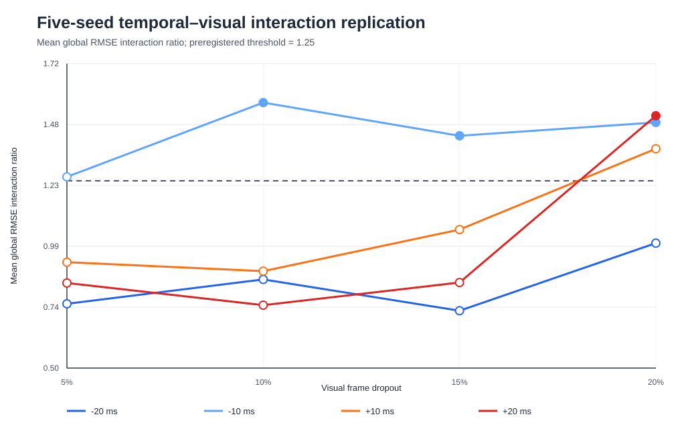
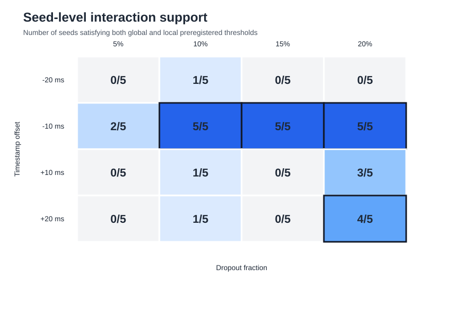

# V2-E01b five-seed temporal–visual replication

## Status

`replicated_supported`

At least one preregistered joint cell satisfies the strict five-seed replication criterion. This upgrades the parent effect from a single-mask pilot to a stochastic replication on one trajectory.

## Fixed design

- five timestamp offsets
- five dropout levels
- five nested-dropout seeds
- 125 analytical cells
- 105 unique physical scenarios
- 134 estimator executions

## Replicated cell results

| Offset (ms) | Dropout | Seed support | Mean global ratio | Global additive CI lower (m) | Mean local ratio | Local additive CI lower (m) | Replicated |
|---:|---:|---:|---:|---:|---:|---:|---|
| -20 | 5% | 0/5 | 0.758 | -0.0377 | 1.033 | -0.0466 | False |
| -20 | 10% | 1/5 | 0.855 | -0.0343 | 1.049 | -0.0642 | False |
| -20 | 15% | 0/5 | 0.730 | -0.0554 | 0.752 | -0.1259 | False |
| -20 | 20% | 0/5 | 1.001 | -0.0117 | 1.232 | -0.0080 | False |
| -10 | 5% | 2/5 | 1.266 | -0.0049 | 1.525 | 0.0046 | False |
| -10 | 10% | 5/5 | 1.564 | 0.0032 | 1.880 | 0.0286 | True |
| -10 | 15% | 5/5 | 1.431 | 0.0112 | 1.694 | 0.0400 | True |
| -10 | 20% | 5/5 | 1.484 | 0.0104 | 1.835 | 0.0365 | True |
| +10 | 5% | 0/5 | 0.924 | -0.0234 | 1.020 | -0.0543 | False |
| +10 | 10% | 1/5 | 0.888 | -0.0511 | 0.873 | -0.1152 | False |
| +10 | 15% | 0/5 | 1.055 | 0.0007 | 1.009 | -0.0313 | False |
| +10 | 20% | 3/5 | 1.379 | -0.0188 | 1.380 | -0.0456 | False |
| +20 | 5% | 0/5 | 0.841 | -0.0202 | 1.041 | -0.0302 | False |
| +20 | 10% | 1/5 | 0.752 | -0.0668 | 0.854 | -0.1327 | False |
| +20 | 15% | 0/5 | 0.843 | -0.0183 | 0.842 | -0.0497 | False |
| +20 | 20% | 4/5 | 1.511 | 0.0104 | 1.708 | 0.0253 | True |

## Strongest cell

- offset: `-10 ms`
- dropout: `10%`
- seed support: `5/5`
- global interaction ratio: `1.563547`
- local interaction ratio: `1.880452`
- replicated supported: `True`

## Figures

## Claim boundary

This experiment provides five-mask stochastic replication on one official deterministic trajectory. It does not establish multi-trajectory, real-world or literature-level generalization. Sign-asymmetry and nonmonotonicity analyses are secondary and must not replace the preregistered primary criterion.
